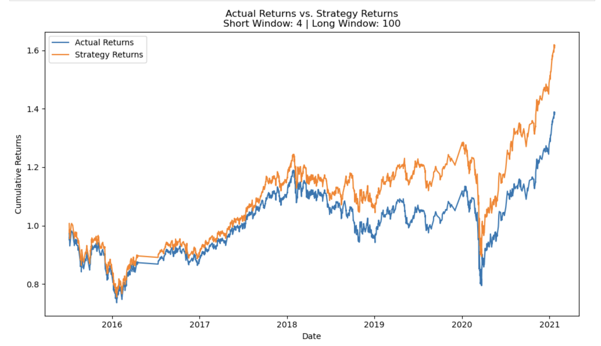

# Trading bot strategy
Module 14 assignment

Evaluation Report
## Baseline Strategy
Performance Metrics:

Precision:
Class -1.0: 0.43
Class 1.0: 0.56

Recall:
Class -1.0: 0.04
Class 1.0: 0.96

F1-score:
Class -1.0: 0.07
Class 1.0: 0.71

Accuracy: 0.55

Summary:

The baseline strategy, utilizing a support vector machine (SVM) classifier with simple moving average (SMA) trading signals, achieved an accuracy of 55%. However, the precision and recall values for the negative class (-1.0) were notably lower compared to the positive class (1.0), indicating a bias towards predicting positive outcomes. This suggests that the model may not perform well in capturing downward market trends.

## Tuned Strategy (25 fast SMA, 150 slow SMA, 9-month training data)

Performance Metrics:

Precision:
Class -1.0: 0.42
Class 1.0: 0.56

Recall:
Class -1.0: 0.09
Class 1.0: 0.90

F1-score:
Class -1.0: 0.15
Class 1.0: 0.69

Accuracy: 0.55

Summary:

After tuning the strategy by adjusting the SMA windows and increasing the training data period to 9 months, there was a slight improvement in the recall for the negative class (-1.0). However, the overall performance metrics remained relatively unchanged compared to the baseline strategy. The model still exhibits a bias towards positive predictions.

Comparison
The tuned strategy showed marginal improvements in capturing downward market trends compared to the baseline strategy. However, the overall performance metrics remained similar, suggesting that further enhancements may be necessary to achieve significant improvements.

## Random Forest Classifier Strategy
Performance Metrics

Precision:
Class -1.0: 0.44
Class 1.0: 0.58

Recall:
Class -1.0: 0.66
Class 1.0: 0.35

F1-score:
Class -1.0: 0.53
Class 1.0: 0.43

Accuracy: 0.49

Conclusion

The strategy using the Random Forest Classifier underperformed significantly compared to the baseline and tuned strategies. It had relatively high precision for the negative class but low recall, indicating it predicted negative returns well but missed many of them. Additionally, the overall accuracy is lower than both the baseline and tuned strategies.

Overall Analysis

The tuned strategy with SMA windows of 25 and 150, along with 9 months of training data, slightly improved the performance compared to the baseline strategy. However, there is still room for improvement, especially in predicting negative returns. The Random Forest Classifier strategy underperformed compared to both the baseline and tuned strategies, indicating that the choice of classifier significantly impacts the trading algorithm's performance. Further optimizations and possibly exploring different machine learning models could lead to better results.# Trading bot strategy
Module 14 assignment

Evaluation Report
## Baseline Strategy
Performance Metrics:

Precision:
Class -1.0: 0.43
Class 1.0: 0.56

Recall:
Class -1.0: 0.04
Class 1.0: 0.96

F1-score:
Class -1.0: 0.07
Class 1.0: 0.71

Accuracy: 0.55

Summary:

The baseline strategy, utilizing a support vector machine (SVM) classifier with simple moving average (SMA) trading signals, achieved an accuracy of 55%. However, the precision and recall values for the negative class (-1.0) were notably lower compared to the positive class (1.0), indicating a bias towards predicting positive outcomes. This suggests that the model may not perform well in capturing downward market trends.

## Tuned Strategy (25 fast SMA, 150 slow SMA, 9-month training data)

Performance Metrics:

Precision:
Class -1.0: 0.42
Class 1.0: 0.56

Recall:
Class -1.0: 0.09
Class 1.0: 0.90

F1-score:
Class -1.0: 0.15
Class 1.0: 0.69

Accuracy: 0.55

Summary:

After tuning the strategy by adjusting the SMA windows and increasing the training data period to 9 months, there was a slight improvement in the recall for the negative class (-1.0). However, the overall performance metrics remained relatively unchanged compared to the baseline strategy. The model still exhibits a bias towards positive predictions.

Comparison
The tuned strategy showed marginal improvements in capturing downward market trends compared to the baseline strategy. However, the overall performance metrics remained similar, suggesting that further enhancements may be necessary to achieve significant improvements.

## Random Forest Classifier Strategy
Performance Metrics

Precision:
Class -1.0: 0.44
Class 1.0: 0.58

Recall:
Class -1.0: 0.66
Class 1.0: 0.35

F1-score:
Class -1.0: 0.53
Class 1.0: 0.43

Accuracy: 0.49

Conclusion

The strategy using the Random Forest Classifier underperformed significantly compared to the baseline and tuned strategies. It had relatively high precision for the negative class but low recall, indicating it predicted negative returns well but missed many of them. Additionally, the overall accuracy is lower than both the baseline and tuned strategies.

Overall Analysis

The tuned strategy with SMA windows of 25 and 150, along with 9 months of training data, slightly improved the performance compared to the baseline strategy. However, there is still room for improvement, especially in predicting negative returns. The Random Forest Classifier strategy underperformed compared to both the baseline and tuned strategies, indicating that the choice of classifier significantly impacts the trading algorithm's performance. Further optimizations and possibly exploring different machine learning models could lead to better results.
